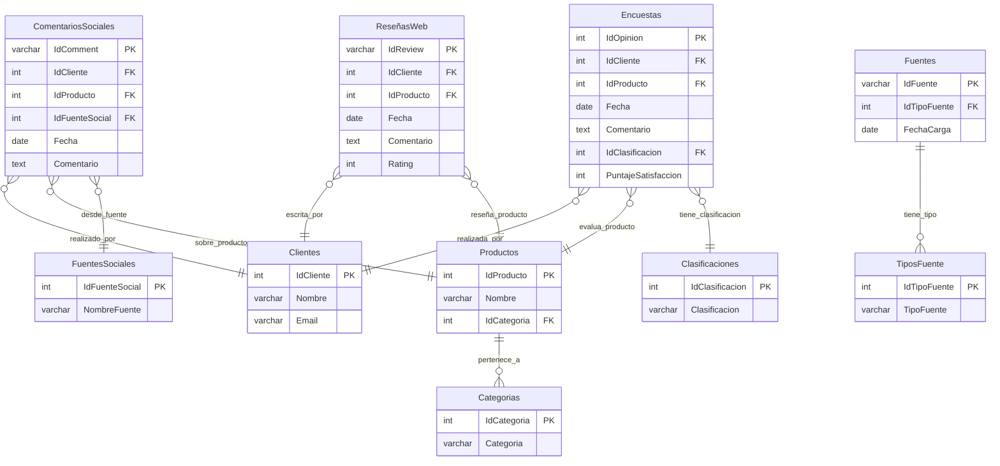

# Sistema de Análisis de Opiniones de Clientes

## 📋 Descripción del Proyecto
Pipeline ETL para el procesamiento y análisis de opiniones de clientes provenientes de múltiples fuentes (web, redes sociales, encuestas).

## 🏗️ Estructura del Proyecto

```
analisis_opiniones/
├── data/
│ ├── clients.csv
│ ├── products.csv
│ ├── fuente_datos.csv
│ ├── social_comments.csv
│ ├── surveys_part1.csv
│ └── web_reviews.csv
├── database.py
├── main.py
├── DB_Script.sql
├── requirements.txt
└── README.md
```

## Requisitos
- Python 3.8+
- SQL Server
- pandas, pyodbc, python-dotenv

## Instalación
```bash
pip install -r requirements.txt
```

## Uso
```python 
main.py
```

## Modelo de Datos
- Clientes (IdCliente) ← ComentariosSociales → Productos (IdProducto)
- Clientes (IdCliente) ← Encuestas → Productos (IdProducto)
- Clientes (IdCliente) ← ResenasWeb → Productos (IdProducto)
- Productos (IdProducto) → Categorias (IdCategoria)
- Fuentes (IdFuente) → TiposFuente (IdTipoFuente)

### Diagrama Entidad-Relacion



# Informe Técnico - Pipeline ETL

## 1. Diseño de Base de Datos
Modelo relacional normalizado con 10 tablas.

## 2. Pipeline ETL
### Extracción
6 archivos CSV - 1,700 registros

### Transformación
Limpieza y normalización de datos

### Carga
Inserción en SQL Server - 816 registros

## 3. Tecnologías
Python, SQL Server, pandas

## 4. Resultados
Proceso ejecutado exitosamente
